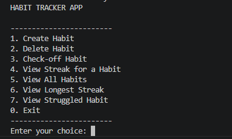
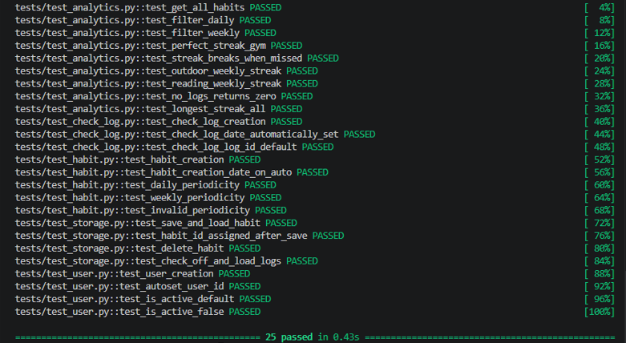

# Habit Tracker App
# By Lindelani Nethamba — Matric number 9218300
GitHub: https://github.com/lindelaninethamba-lgtm/habit-tracker-app

This is a Python backend for a habit tracking application built using object-oriented 
and functional programming principles. It lets you create and track daily and weekly habits from the command line.
Python 3.7+ was chosen for this application and SQLite because it is built-in in python, serverless, and provides reliable persistence. 

1. To run the app: python main.py
2. To run the tests: python -m pytest -v
3. To install pytest: pip install pytest

# The  Project structure is as follows
1. main.py  runs the app
2. habit.py  is the Habit class
3. storage.py  runs all database operations
4. analytics.py  runs all analytics functions such as computing streaks, loading habits and filtering by habit periosicity
5. cli.py  is the menu interface which allows the user to give input and returns the relevant output
6. predefined_data.py loads 5 habits and 4 weeks of data and also data used for running tests
7. tests/ folder contains all unit tests and fixtures

On first run, the app automatically loads 5 predefined habits with 4 weeks 
of tracking data. 

The following 5 habits are loaded automatically on first run(Habit, Description, Periodicity):

 Outdoor Activity, 1 hour walk outside,  Weekly 
 Gym Session, 2 hour gym session,  Daily 
 Studying,  2 hours study,  Daily 
 Reading, Read 2 chapters,  Weekly 
 Healthy Diet, Stick to healthy diet, Daily 

Each habit comes with 4 weeks of simulated tracking data for testing purposes.

# The analytics module handles functional programming operations as follows:
1. get_all_habits - Returns list of all tracked habits 
2. filter_by_periodicity - Filters habits by daily or weekly 
3. longest_streak_for_habit - Returns longest streak for one habit 
4. longest_streak_all - Returns habit with longest streak overall 
5. habit_struggled_most - returns habit with the lowest longest streak
6. Analytics are implemented using the **functional programming paradigm** 
7. with filter(), map() and reduce()

# Instructions on running the app:

The CLI menu will appear with the following options:

## How to Create a Habit
1. Run python main.py
2. Select option 1 from the menu
3. Enter the habit name when prompted
4. Enter a description
5. Enter the periodicity: daily or weekly
6. The habit is saved automatically

## How to Complete (Check-off) a Habit
1. Select option 3 from the menu
2. A numbered list of your habits will appear
3. Enter the number of the habit you completed
4. The completion is recorded with the current date and time

## How to View Your Streak
1. Select option 4 from the menu
2. Pick a habit from the numbered list
3. Your longest streak for that habit is displayed

## How to View the Longest Streak Across All Habits
1. Select option 6 from the menu
2. The habit with the longest streak is displayed automatically

## Test Results
Expected output is all tests passing:
All 26 tests passing:

